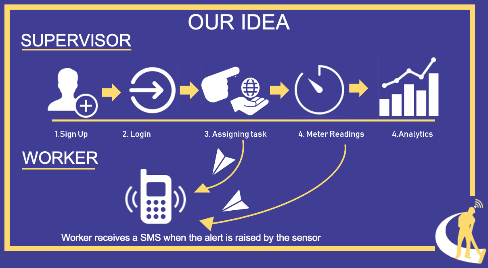

**CleanCARE**

This Project was created for the Smart India Hackthon 2019 for PD Hinduja Group of Hospitals and MRC. This aims at creating an interactive washroom management and maintenance application that makes the life of the worker, supervisor and the general public way better. 

**The sensor reading is been fetched from thingSpeak.**

#**USAGE**#

`clone the repository and run using Android Studios`

